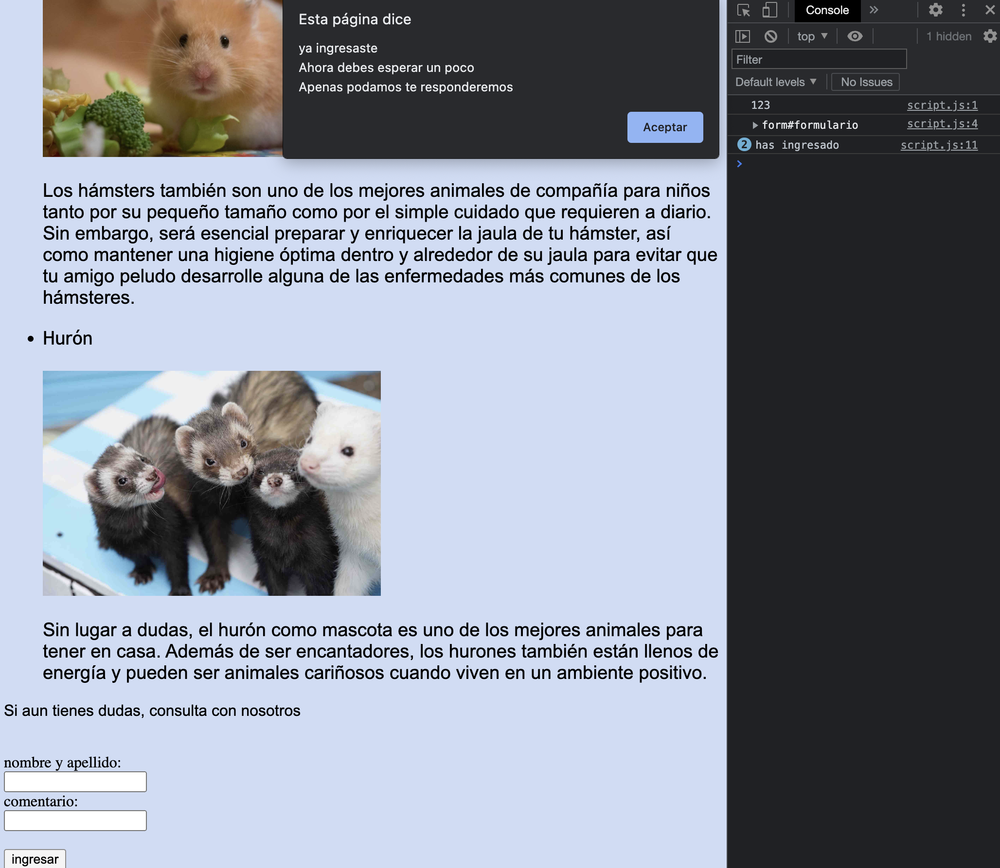
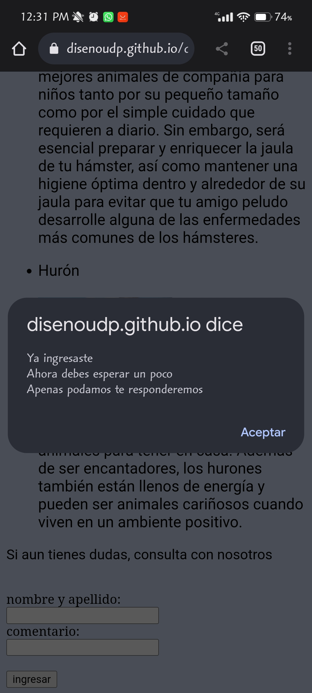

# solemne-02

ir a mi fork del repositorio, y hacer click en "sync fork"

luego hacer click en el botón verde "update branch"

con esto lograremos que nuestro fork esté al día con el original ("up to date")

