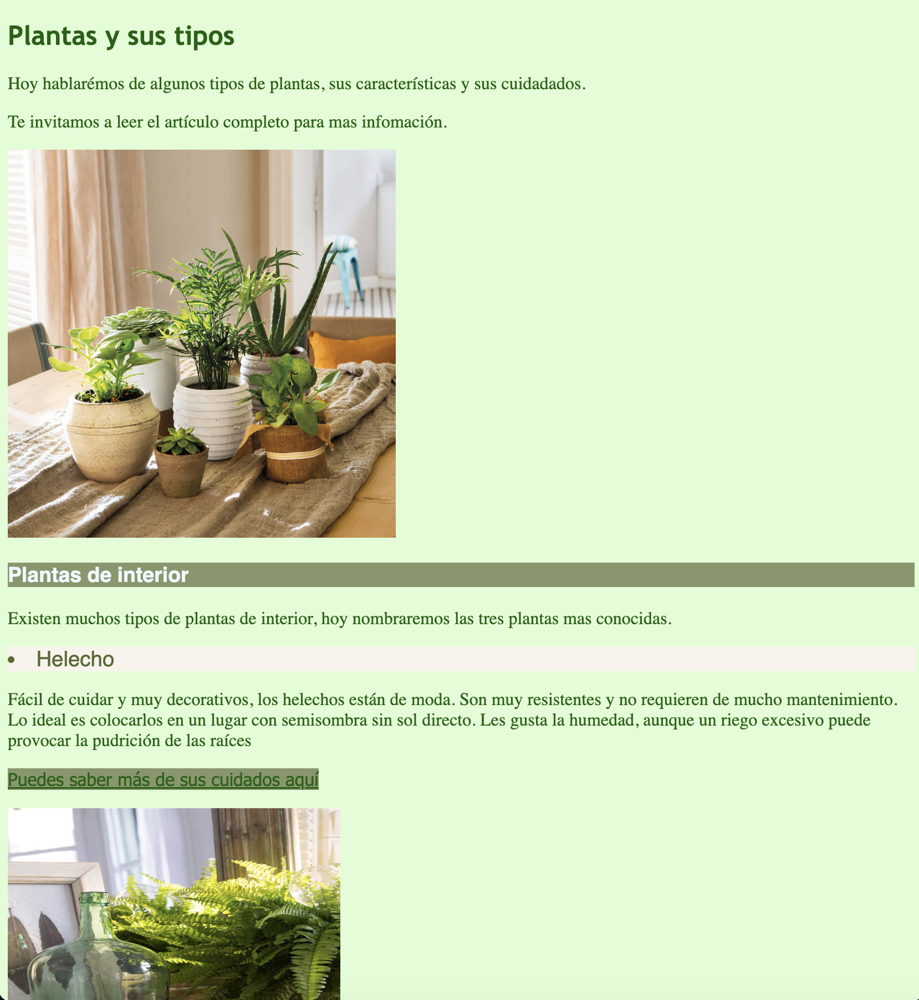
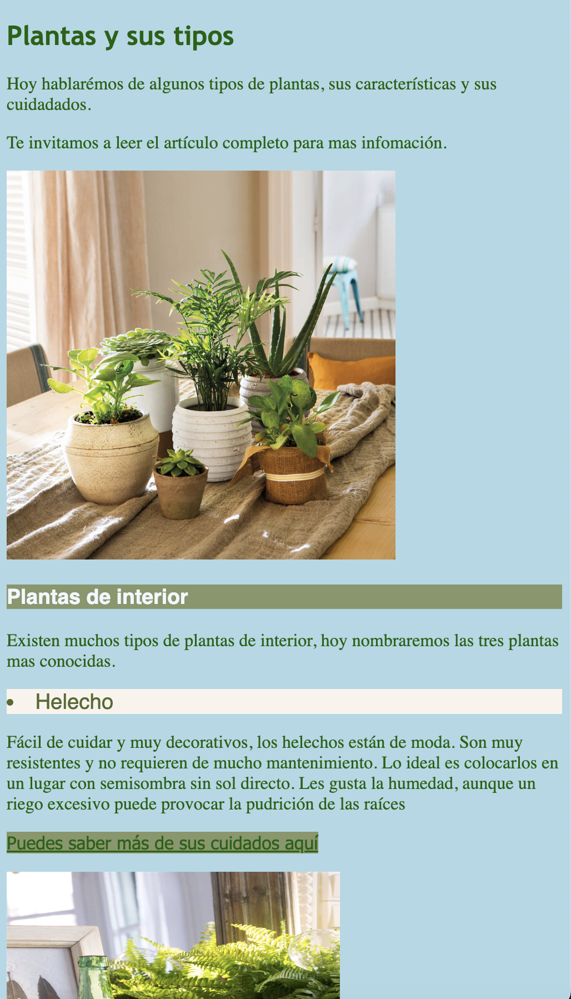
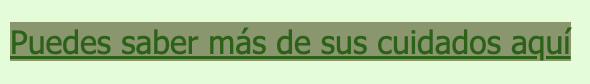
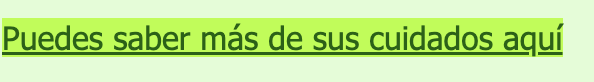
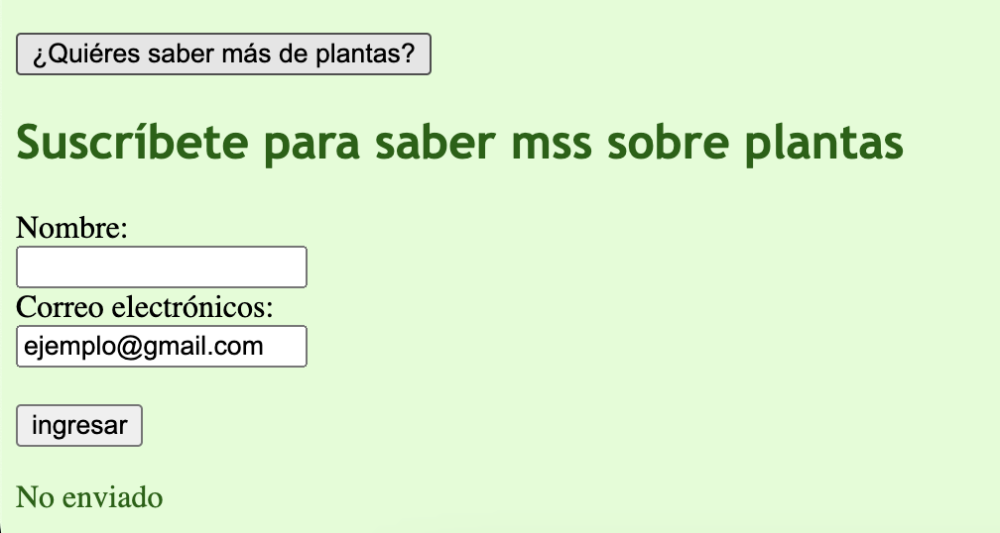
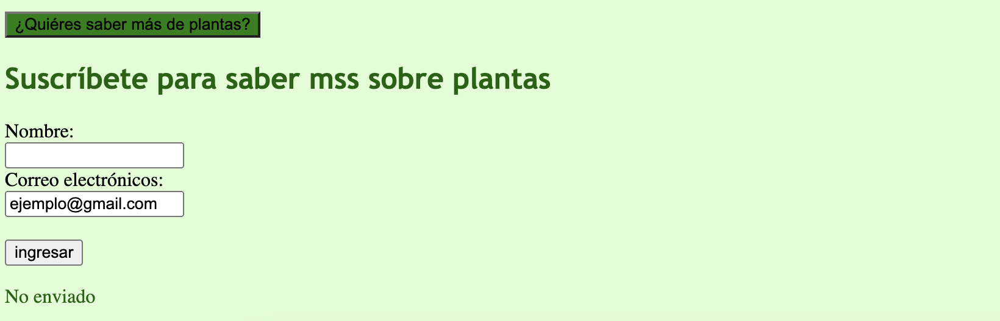

# solemne-02

Buenos dias, en mi web, quise cumplir el fin de ser un tipo de blog, en el cual se habla de los tipos de plantas más comunes que existen, más específicamente sobre las plantas de interior. En la página podemos ver las fotos de cada planta e infomación tanto de sus cuidados, como de sus características.

PANTALLAZOS WEB:

Links
https://www.w3schools.com/html/html_forms.asp

https://www.w3schools.com/cssref/sel_hover.php
