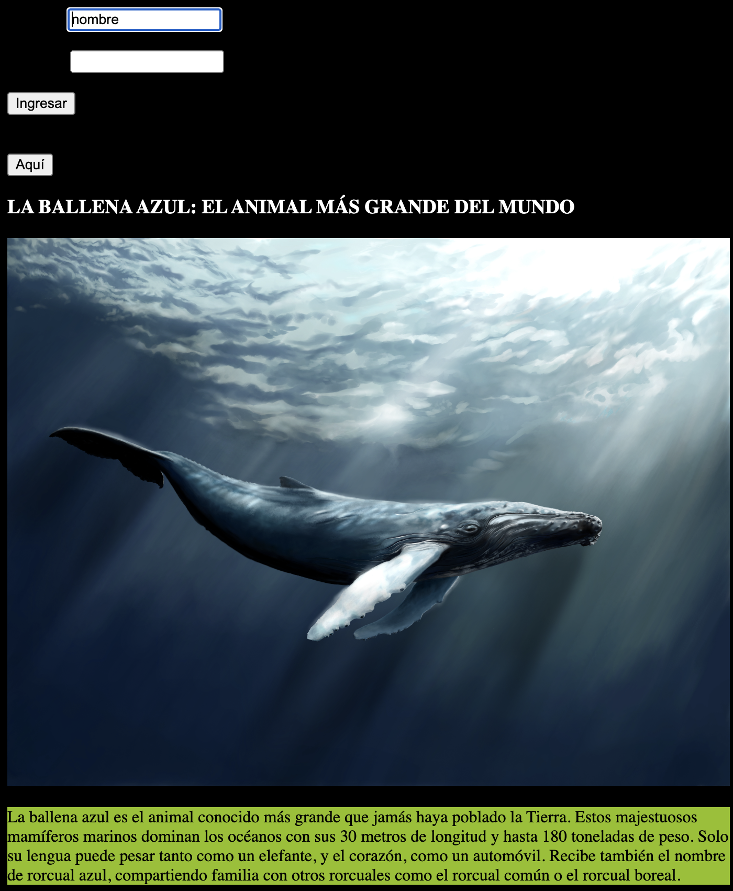
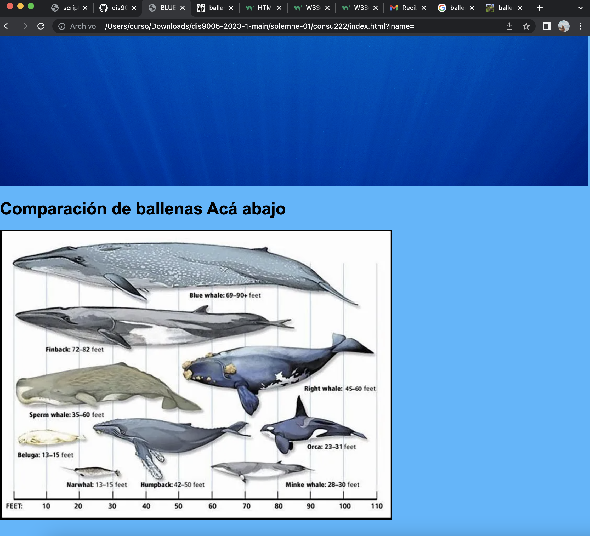
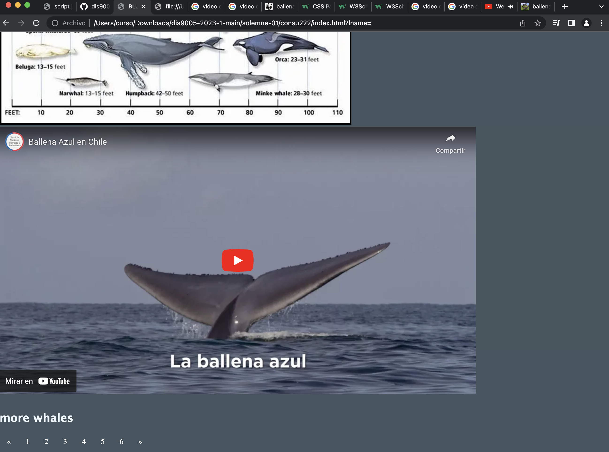
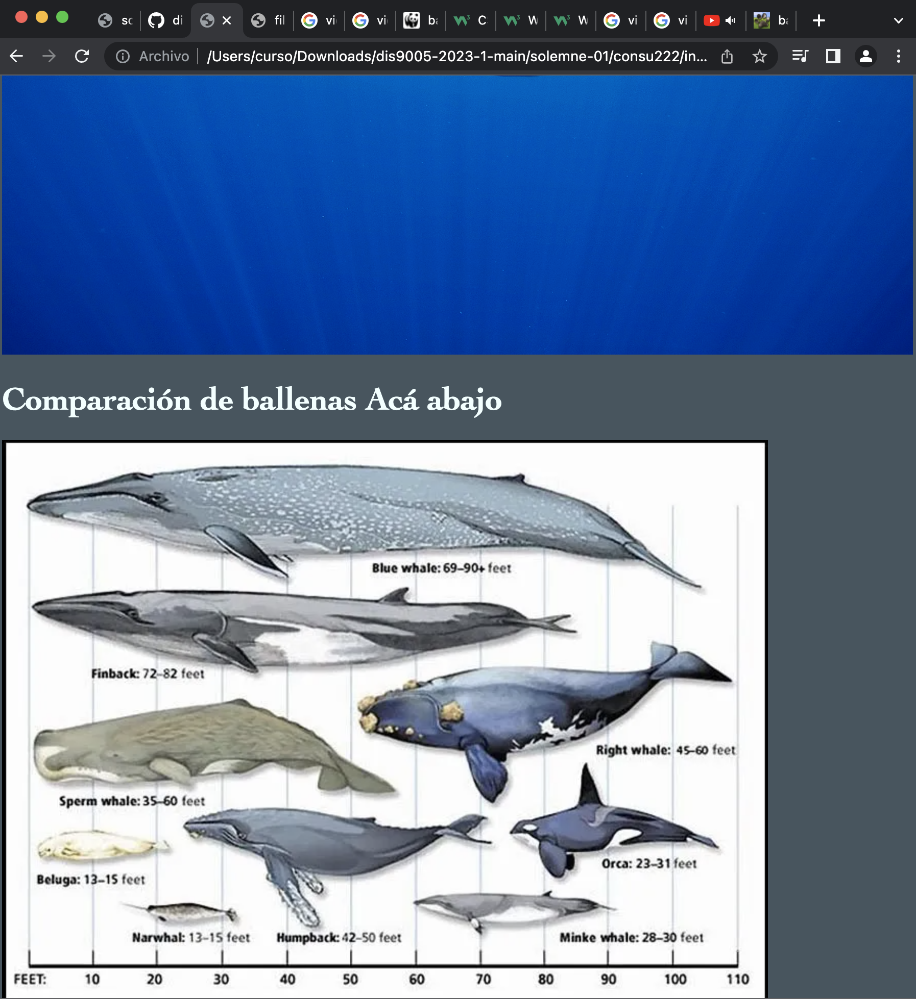
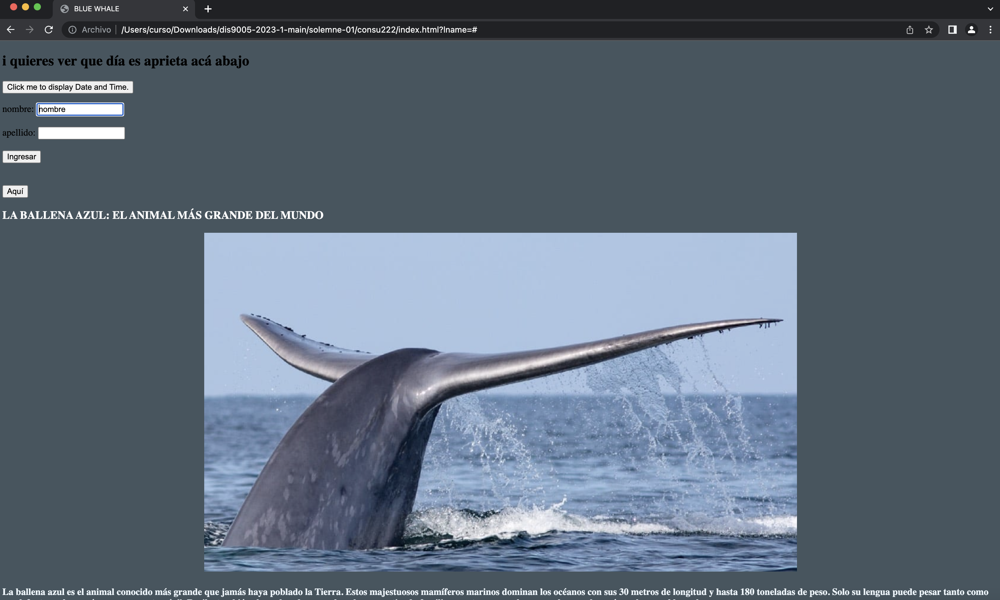
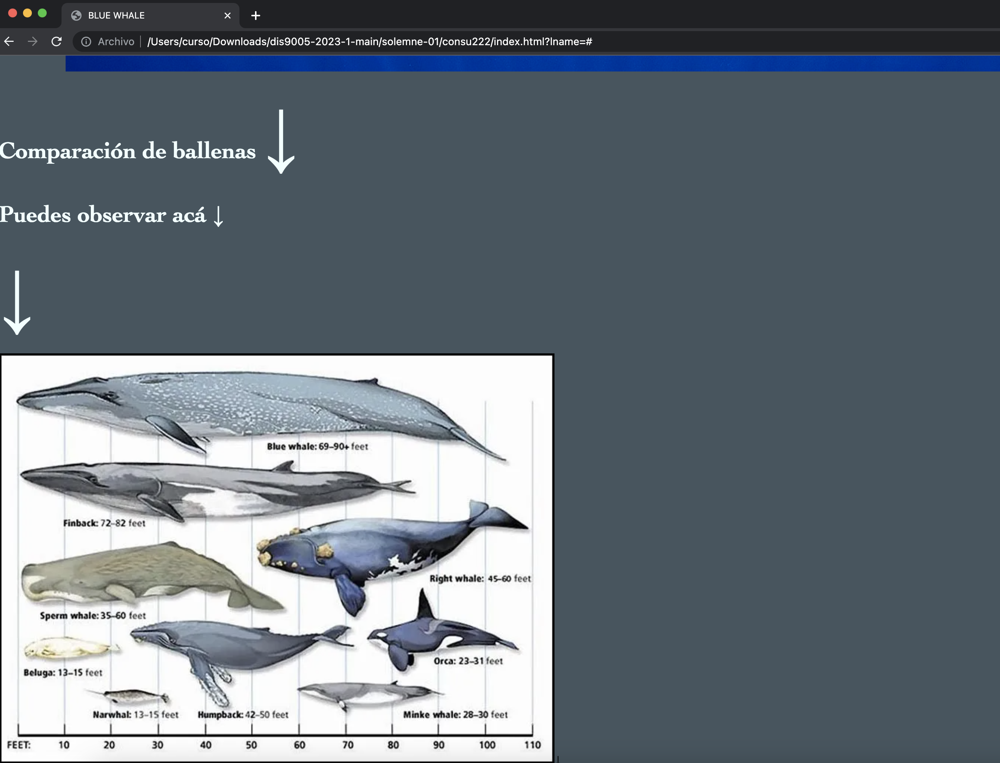
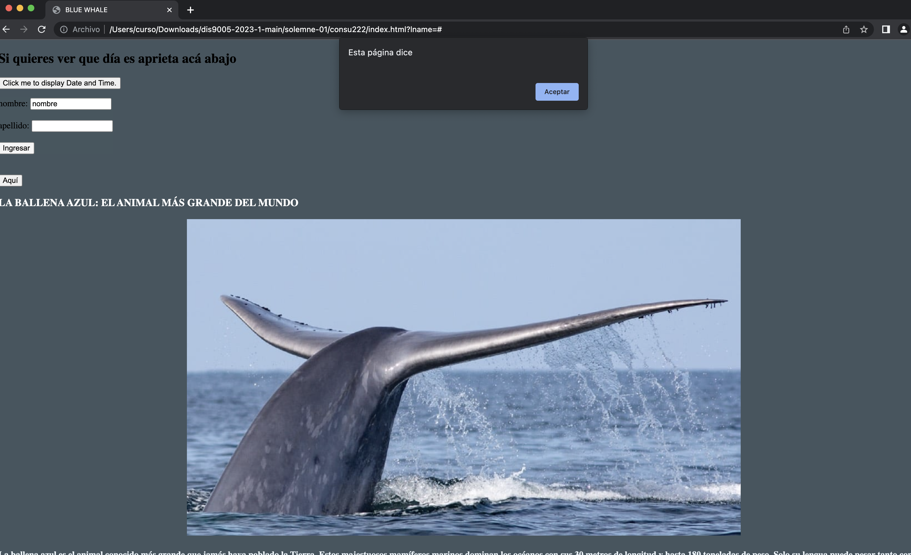
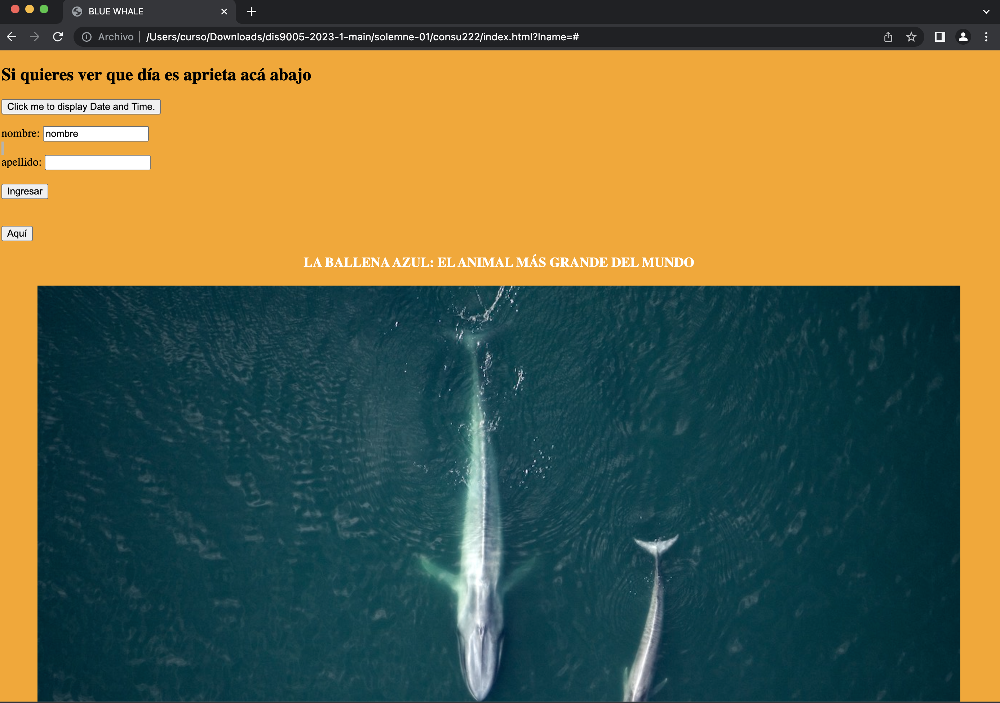

# solemne-02
En cada pantallazo, se ven los cambios que fui haciendo en la página web, mi página es informativa, ya que nos cuenta acerca de la ballena azul y nos va mostrando imaganes y un texto acerca de la ballena. al final de la pagina se ve un video más en profundidad de la ballena. 
ocupe varias imagenes de la ballena azul, para que se apreciara en diferentes perspectivas, agregue un formulario básico para hacerlo funcionar, puse texto de infromación destacado en color para que se note que es importante. :)
pantallazos:

ir a mi fork del repositorio, y hacer click en "sync fork"

luego hacer click en el botón verde "update branch"

con esto lograremos que nuestro fork esté al día con el original ("up to date")

