# solemne-02

## Pantallazos proceso

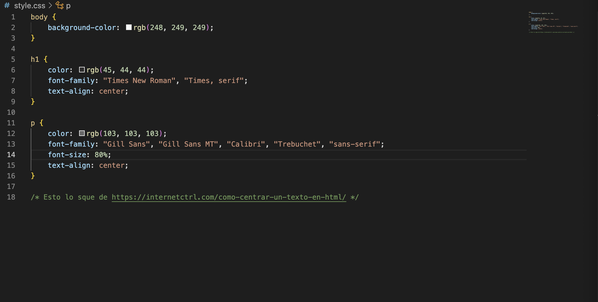
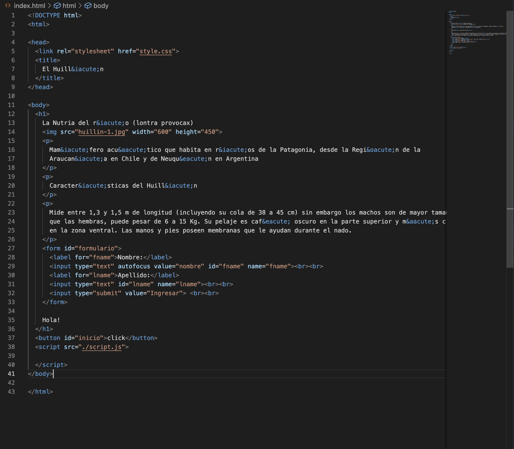
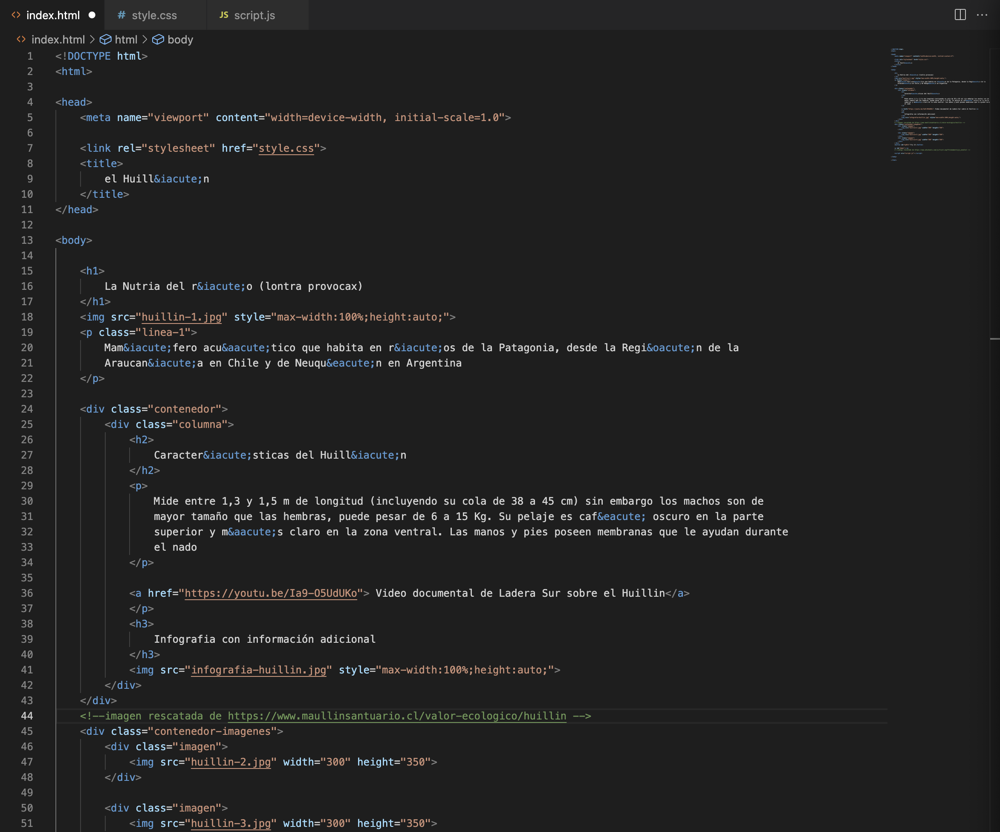
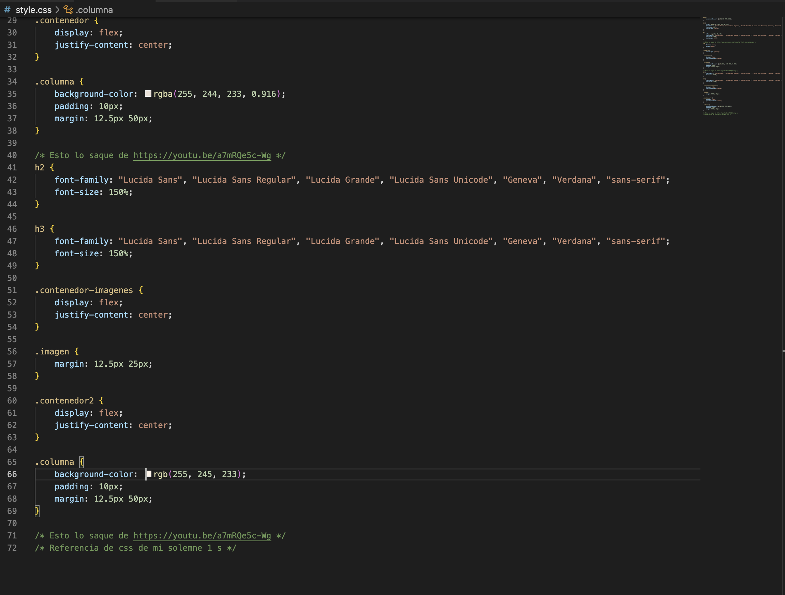
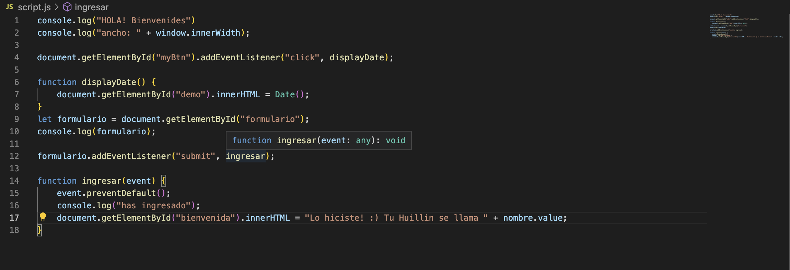
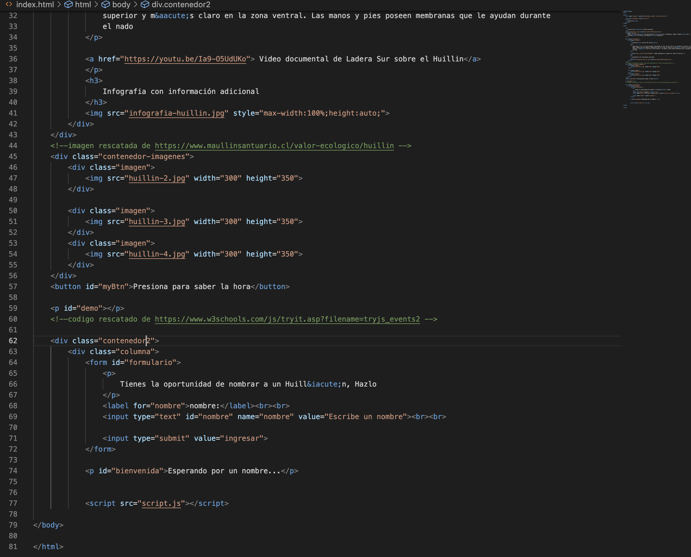
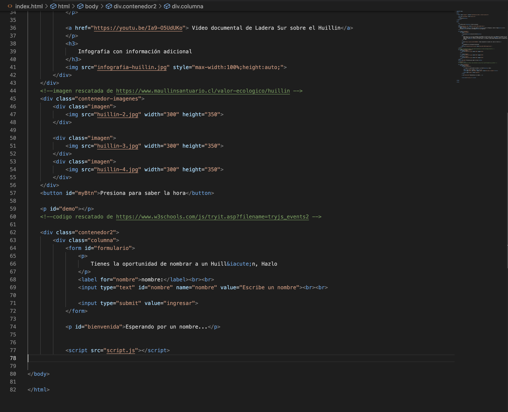
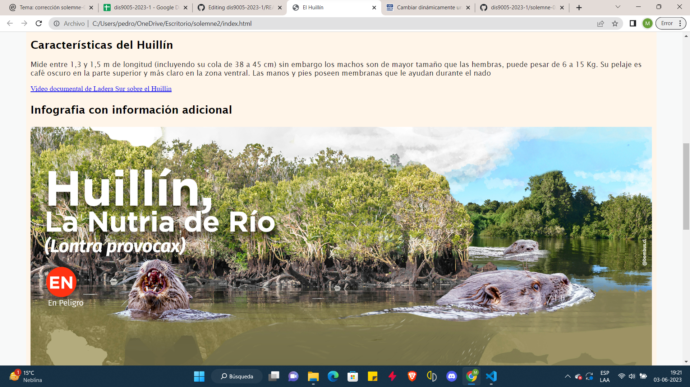
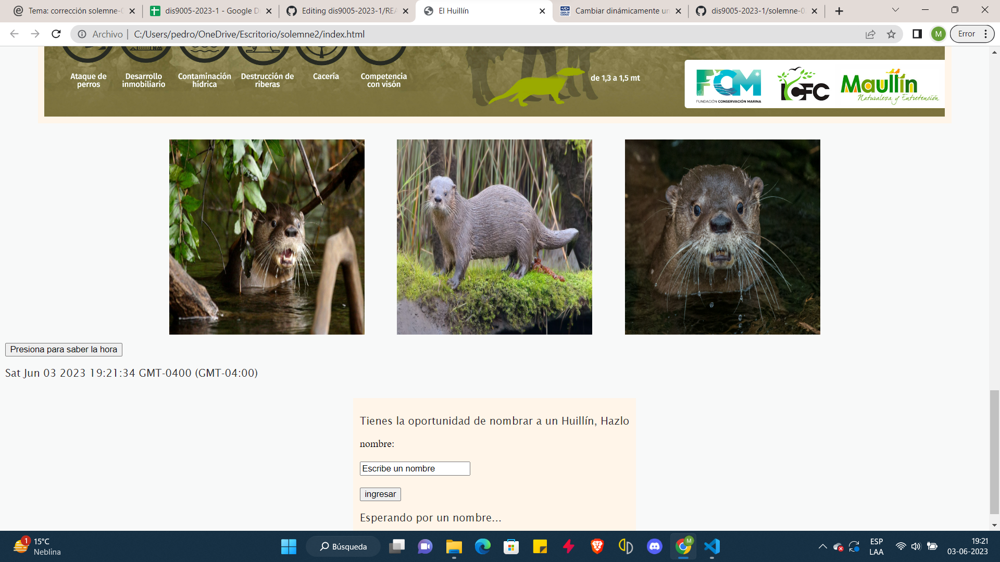

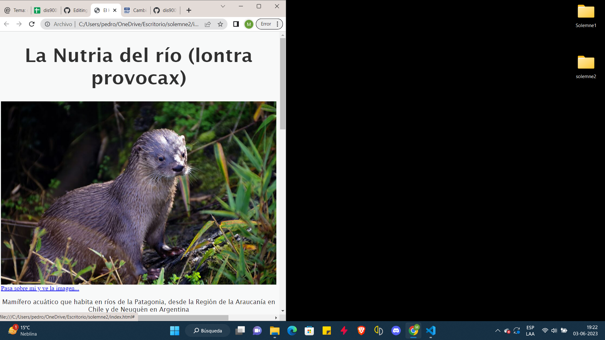
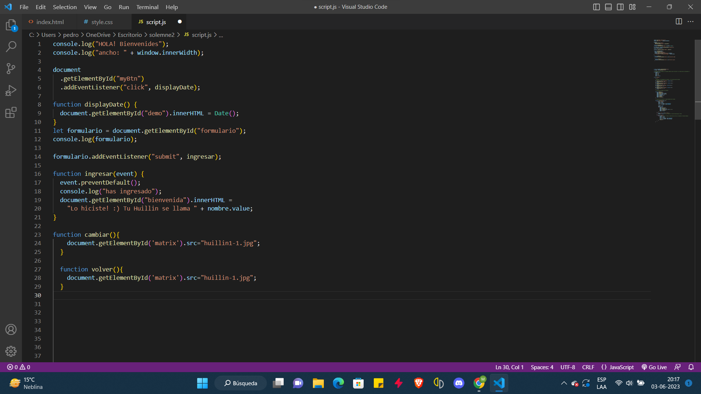
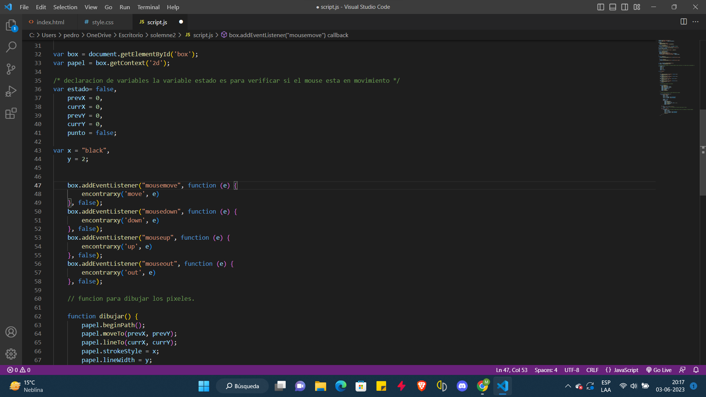

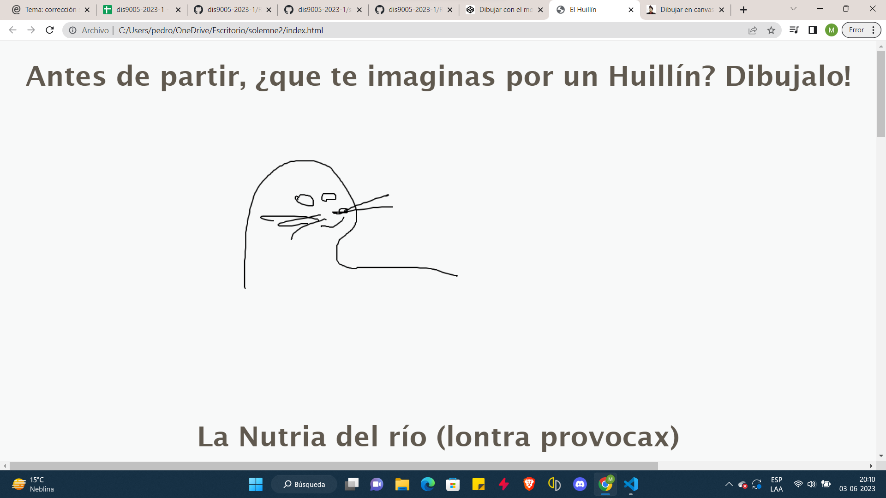

## Imágenes usadas

## Links usados

1. https://lineadecodigo.com/javascript/cambiar-dinamicamente-una-imagen-con-javascript/
2. https://www.maullinsantuario.cl/valor-ecologico/huillin
3. https://www.w3schools.com/js/tryit.asp?filename=tryjs_events2
4. https://www.w3schools.com/cssref/pr_text_text-align.php
5. https://youtu.be/a7mRQe5c-Wg
6. https://codepen.io/alexcu21/pen/GEoqWj
