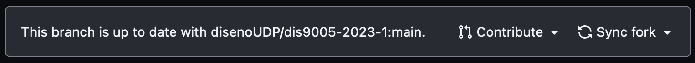
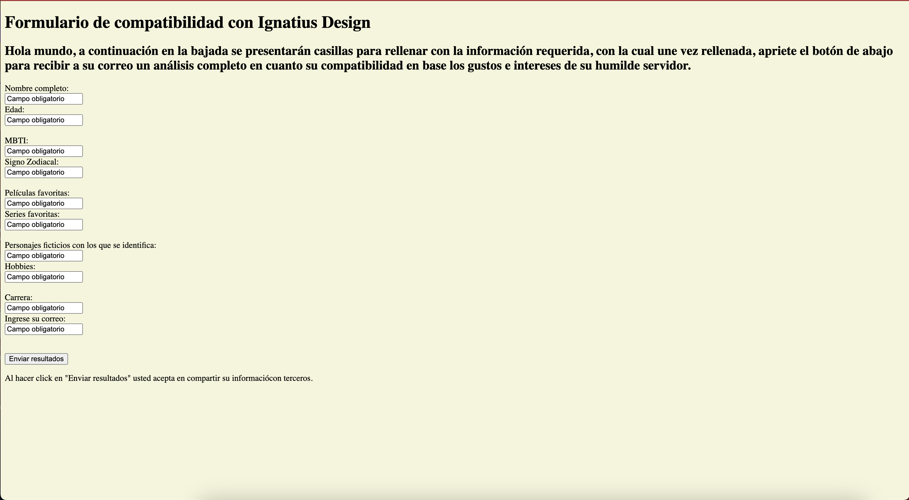

# solemne-02

ir a mi fork del repositorio, y hacer click en "sync fork"

luego hacer click en el botón verde "update branch"

con esto lograremos que nuestro fork esté al día con el original ("up to date")

Previsualizacion en celular

Previsualizacion de index y pagina desde el ordenador

Previsualizacion de Java script y pagina desde el ordenador

Previsualizacion de Style y pagina desde el ordenador

