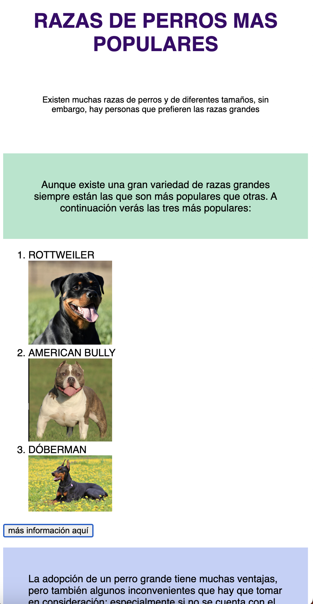
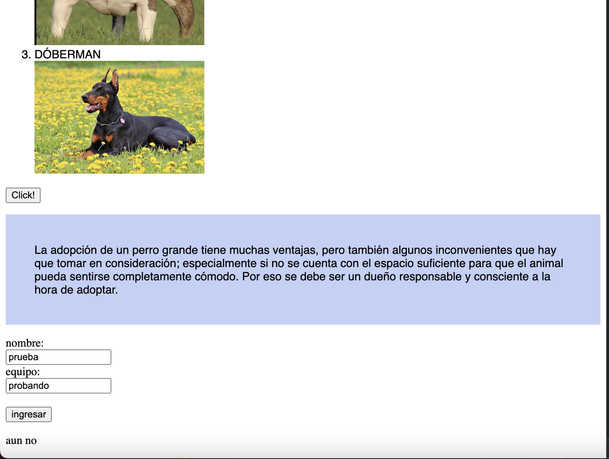
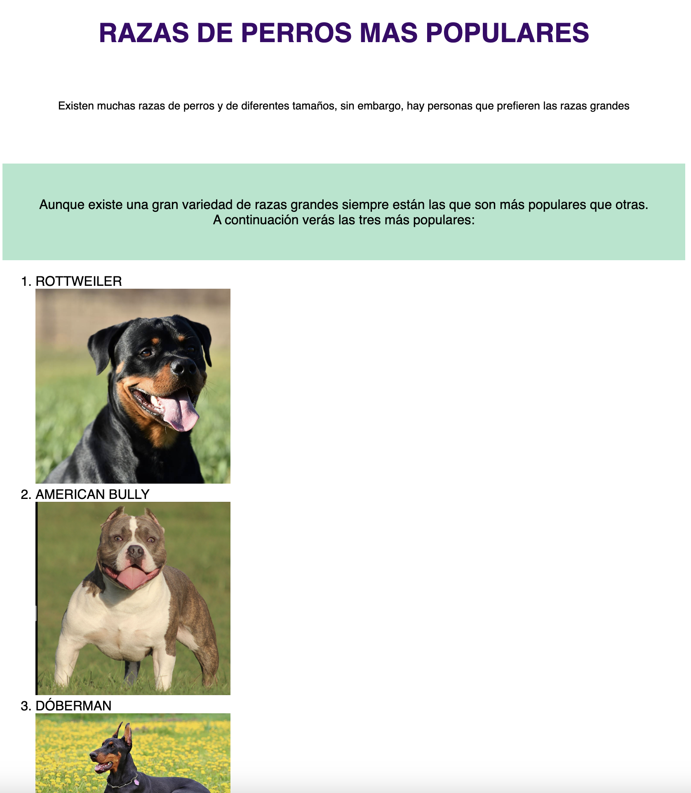
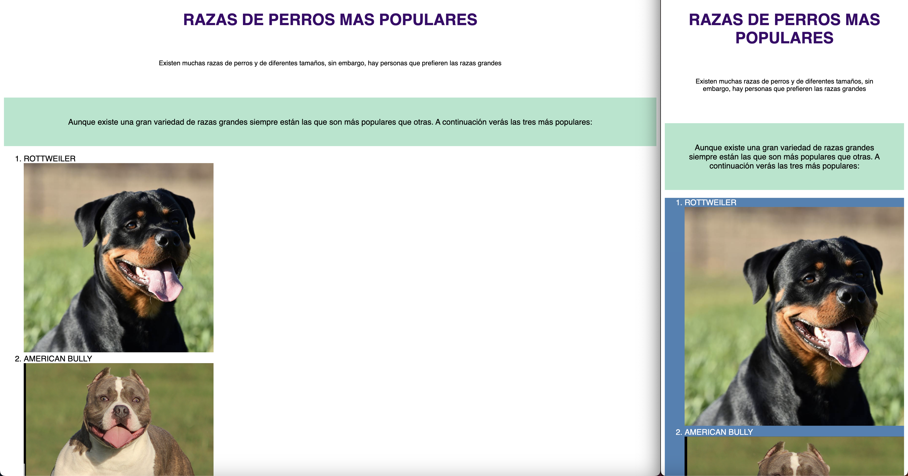

# solemne-02

ir a mi fork del repositorio, y hacer click en "sync fork"

luego hacer click en el botón verde "update branch"

con esto lograremos que nuestro fork esté al día con el original ("up to date")

Pantallazos de como se ve la pagina web observada desde la pantalla de un computador

La siguiente foto muestra el formulario donde se puede ingresar tu nombre y tu raza de mascota favorita

En las siguentes ds fotografias se puede observa como reacciona la pagina web en un un celular y se muestran los cambios que esta sufre

La sienguiente fotografia muestra la comparación entre el sitio web en el computador y el un celular

