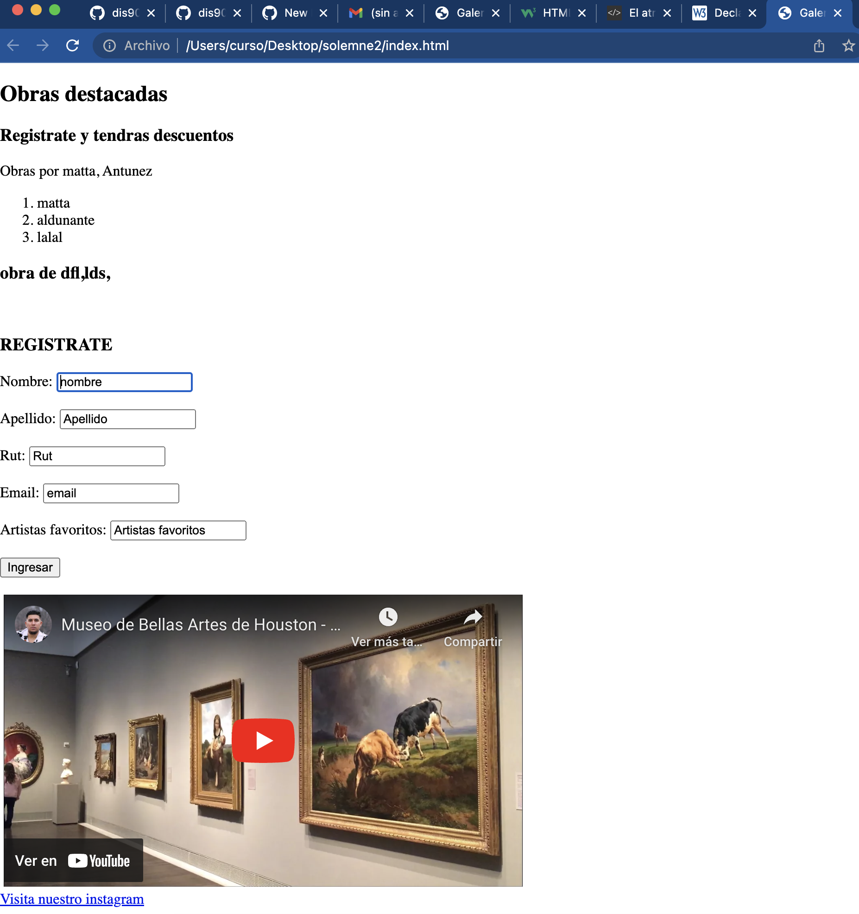
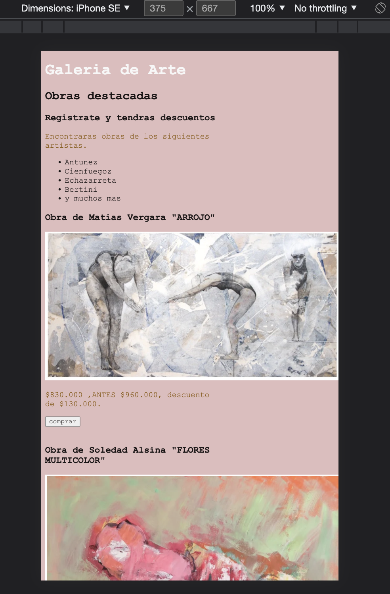
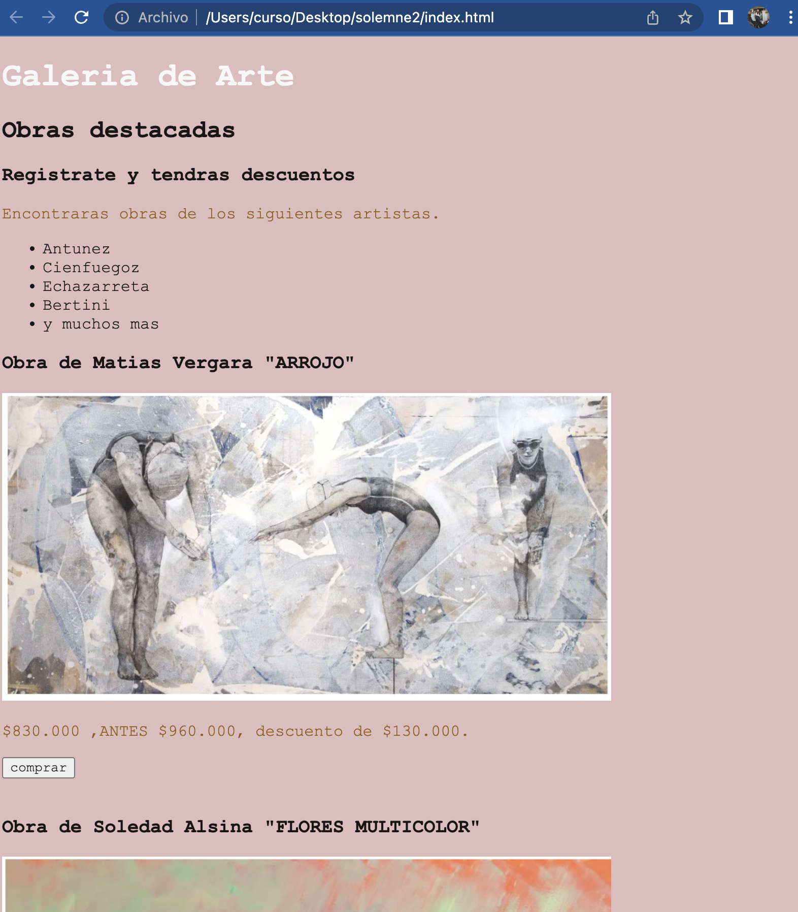

# solemne-02

Mi registro a continuacion

Hare una pagina que es una galeria de arte,
pondre la opcion de compra de obras y luego
usare el fomulario para que se registren y tengan descuentos.
En la primera captura ordene que cosas debia tener 

Despues aplique el CSS 

Aca se puede ver como se ve desde un dispositivo movil, como un iphone se 

Referi todo de la pagina https://www.w3schools.com/
Tambien referi de mi entrega pasada y apuntes.
Me inspire de la pagina web chilena https://galeriachilena.com/?gclid=Cj0KCQjwmtGjBhDhARIsAEqfDEc-GYVIWBktpksCUCL3plh_DYzVVqeGKotw0bAA_NintssWwEjJRz0aAltWEALw_wcB
Ya que a futuro me gustaria vender alguna cosa que tenga por mi propio sitio web, de esta forma me acerco un poco mas a lo que quiero lograr.
CORREGI:
README: Estoy explicando lo que hice.
PUNTUACION: Las tildes por lo que ahora estan disponibles.
CSS: añadi reglas.
JS: añadi la info de la fecha.
FORM: añadi una consecuencia a cada campo.
Despues de las correciones la pagina web se ve asi
capture

